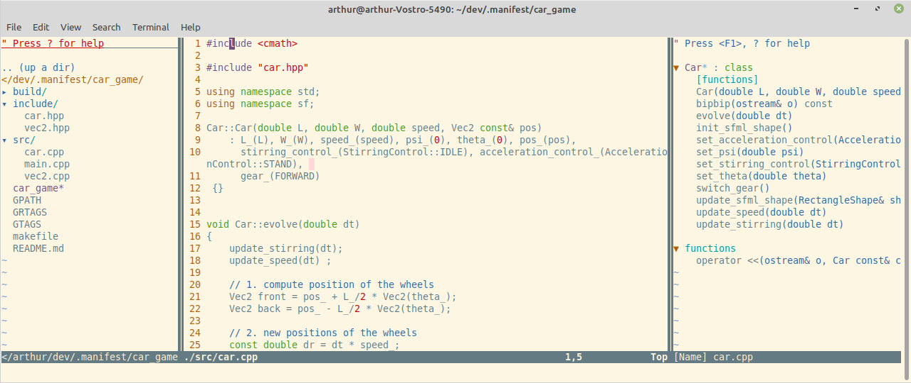

# NeoVIM Config

This repo contains my configuration for NeoVim.

I use Vim-Plug to deal with Plugins. 

It features
- Autocompletion 
- LSP
- File Explorer
- Outline Explorer
- Fuuzy Finder (to allow for string search in file system)
- Autoclosing



## Installation 

Here is the procedure to install NeoVim: 
- go to the install page: https://github.com/neovim/neovim/wiki/Installing-Neovim
- pick the release you want, download the file "nvim-linux64.tar.gz" & extract in your files.
- create a symbolic link with `ln -s <WHERE_YOU_INSTALLED_NVIM> /usr/local/bin/nvim`

Once all done, you're supposed to be able to see it like this: 

```console
arthur@arthur-intel:~/softs$ whereis nvim
nvim: /usr/local/bin/nvim /opt/nvim-linux64/bin/nvim
arthur@arthur-intel:~/softs$ ls /usr/local/bin/nvim
Permissions Size User Date Modified Name
lrwxrwxrwx    32 root 28 Oct 15:21  /usr/local/bin/nvim -> /home/arthur/softs/nvim.appimage*
```
